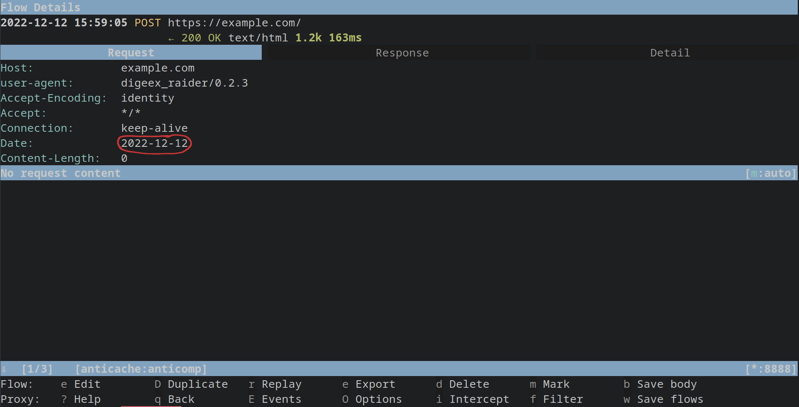
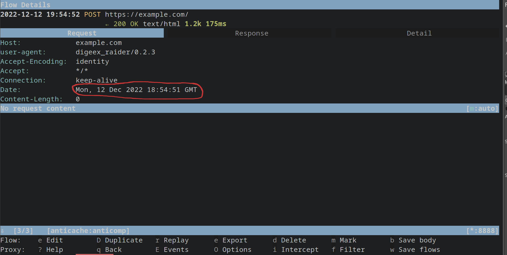

Getting Started
===============

Creating new project
--------------------

After you've installed Raider, you need to create a new project and
add hyfiles to define the information exchange. To create a new
project, run ``raider new`` command:

.. code-block:: bash

   # Either give just a project name
   $ raider new project_name
   New file name (recommended in XX_name.hy format where XX=digits): 01_test.hy

   # Or both the project name and the file name
   $ raider new project_name 01_test.hy
   

And the file at ``~/.config/raider/projects/project_name/01_test.hy``
will be opened either in the text editor defined in the ``EDITOR``
environment variable, or default to ``vim``.

To begin, let's create a "Hello World" configuration first. This is
super easy, you only need to save this in the created file:

.. code-block:: hylang

   (print "Hello World")

And you can see the text printed when running Raider:   

.. code-block:: bash

   $ raider show
   project_name
       - 01_test.hy
   
   # Run the active project
   $ raider run
   Hello World
   CRITICAL:2022-12-11 00:06:42,527:raider - DEFAULT not defined, cannot run! (raider.py:89)

   # Same as above when only 1 project
   $ raider run project_name
   Hello World
   CRITICAL:2022-12-11 00:06:47,333:raider - DEFAULT not defined, cannot run! (raider.py:89)

Adding first Flow
-----------------
   
So besides printing the "Hello World" text it can't do anything
yet. To be able to run something with Raider, you need to at least
define one Flow.

Let's create another file 02_main.hy:

.. code-block:: bash

   $ raider new project_name 02_main.hy

And add the first Flow to it. After receiving response raider will
print the HTTP headers.

.. code-block:: hylang

   (print "main.hy")		
   (setv init
       (Flow
          (Request.get
            "https://example.com/")
          :operations [(Print.headers)]))
     

Running DEFAULT FlowGraph
-------------------------
	  
Now you can see it and run the defined HTTP request. The DEFAULT
FlowGraph is created to point to the first encountered Flow. hyfiles
are processed according to their alphabetical order.

.. code-block:: 

   $ raider show
   project_name
      - 01_test.hy
      - 02_main.hy
      - _project.hy

   $ raider show --flows --graphs
   Hello World
   main.hy
   project_name
       - 02_main.hy
           + DEFAULT -> initialization
             • initialization

   $ raider run
   Hello World
   main.hy
   HTTP response headers:
   Content-Encoding: gzip
   Accept-Ranges: bytes
   Age: 589858
   Cache-Control: max-age=604800
   Content-Type: text/html; charset=UTF-8
   Date: Sat, 10 Dec 2022 23:21:04 GMT
   Etag: "3147526947"
   Expires: Sat, 17 Dec 2022 23:21:04 GMT
   Last-Modified: Thu, 17 Oct 2019 07:18:26 GMT
   Server: ECS (nyb/1D07)
   Vary: Accept-Encoding
   X-Cache: HIT
   Content-Length: 648
   CRITICAL:2022-12-11 00:21:04,978:raider - FlowGraph DEFAULT didn't return (Success). Exiting! (flowstore.py:188)

The CRITICAL error we still get is because when no Flow or FlowGraph
is specified in the ``raider run`` command, the DEFAULT FlowGraph is
used. However, since we've not defined a :class:`Success
<raider.operations.Success>` Operation the FlowGraph didn't
complete. To do so, we can edit the ``02_main.hy`` file like this:

.. code-block:: hylang

   (print "main.hy")		
   (setv initialization
       (Flow
          (Request.get
            "https://example.com/")
          :operations
	   [(Print.headers)
	    (Success)]))
     

Alternatively, you can run just by using the Flow name:

.. code-block:: bash

   $ raider run project_name initialization

Using Raider Plugins
--------------------

Let's say we want to extract the value of one of this headers and
print only it. If you've closed the file, you can open it for editing
like this:

.. code-block:: bash

   $ raider edit project_name 02_main.hy

And now let's edit it to print our header only. To do that, create a
new plugin to store this data

.. code-block:: hylang

   (print "main.hy")

   ;; Create the `date` Header Plugin.
   (setv date (Header "Date"))
   
   (setv initialization
         (Flow
           (Request.get
             "https://example.com/")

	   ;; Extract the date from the response
           :outputs [date]
	   
           :operations [;; Print the date header only
	                (Print date)
                        (Success)]))

And if we run it, we get the date printed:

.. code-block:: bash
		
   $ raider run project_name initialization
   Hello World
   main.hy
   INFO:2022-12-12 15:50:33,200:raider - Running flow initialization (flowstore.py:149)
   Date = Mon, 12 Dec 2022 14:50:33 GMT
   INFO:2022-12-12 15:50:33,751:raider - Success: None (operations.py:745)

Chaining Flows
--------------

Now let's say we want to resend this date for another following
request as a header. To do that, we create a new Flow:

.. code-block:: hylang
   
   (setv send_date
         (Flow
           (Request.post
             "https://example.com/"
	     ;; Use :headers argument to Request to set headers
             :headers [date])))

If we want to see the request, we can use a web proxy
(ZAProxy/BurpSuite/mitmproxy/etc...) and set up raider to use the
proxy:

.. code-block:: bash

   $ raider config --proxy http://localhost:8080

To relay the traffic through this proxy you need to add ``--proxy`` to
the run command:

.. code-block:: bash

   $ raider run project_name send_date --proxy
   Hello World
   main.hy
   INFO:2022-12-12 15:58:52,528:raider - Running flow send_date (flowstore.py:149)
   Header "Date" has an empty value. Input its value manually (enter to skip)
   Date = 2022-12-12		

We get prompted for the Date value since it wasn't set in a previous
Flow (we only ran send_date for now). In the web proxy we can see the
header correctly set up:

To use the date from the previous request, we need to run those two
Flows. This can be done in two ways. The first, we just specify the
Flows we want to run in the command line, separated by commas:

.. code-block:: bash

   $ raider run project_name initialization,send_date --proxy
   Hello World
   main.hy
   INFO:2022-12-12 19:54:51,122:raider - Running flow initialization (flowstore.py:149)
   Date = Mon, 12 Dec 2022 18:54:51 GMT
   INFO:2022-12-12 19:54:51,699:raider - Success: None (operations.py:745)
   INFO:2022-12-12 19:54:51,700:raider - Running flow send_date (flowstore.py:149)

And now Raider uses the value captured in the first Flow:   

The second way to do that, is by using FlowGraphs. When doing that,
Raider runs the first Flow the FlowGraph is pointing to, and follows
all the Next operations until the end, or when Success or Failure is
found. Raider creates the ``DEFAULT`` FlowGraph pointing to the first
defined Flow, so in our case, we can see it pointing to
``initialization``:

.. code-block:: bash

   $ raider show project_name --graph
   Hello World
   main.hy
   project_name
       - 02_main.hy
           + DEFAULT -> initialization

Running FlowGraphs is done the same way as running regular flows.

.. code-block::

   # Alternatively just:
   # $ raider run project_name
   # Or
   # $ raider run
   # If project_name is the active project
   
   $ raider run project_name DEFAULT
   Hello World
   main.hy
   INFO:2022-12-12 20:03:11,047:raider - Running flow initialization (flowstore.py:149)
   Date = Mon, 12 Dec 2022 19:03:11 GMT
   CRITICAL:2022-12-12 20:03:11,562:raider - FlowGraph DEFAULT didn't return (Success). Exiting! (flowstore.py:188)

And doing this only runs the ``initialization`` flow as you can see
from the logs. To chain Flows, you need to use the Next operation, so
the ``02_main.hy`` file will now look like this:

.. code-block:: hylang

   (print "main.hy")
   (setv date (Header "Date"))
   
   (setv initialization
         (Flow
           (Request.get
             "https://example.com/")
           :outputs [date]
           :operations [(Print date)
                        (Next "send_date")]))
   
   
   (setv send_date
         (Flow
           (Request.post
             "https://example.com/"
             :headers [date])
           :operations [(Success)]))
   
And now we can run raider and it'll work as you expect it:

.. code-block:: bash

   $ raider run project_name
   Hello World
   main.hy
   INFO:2022-12-12 20:51:30,404:raider - Running flow initialization (flowstore.py:149)
   Date = Mon, 12 Dec 2022 19:51:30 GMT
   INFO:2022-12-12 20:51:30,951:raider - Running flow send_date (flowstore.py:149)
   INFO:2022-12-12 20:51:31,563:raider - Success: None (operations.py:745)

Creating new FlowGraphs
-----------------------

By default Raider creates the DEFAULT FlowGraph only. You can define
your own with this simple syntax:

.. code-block:: hylang

   (setv authentication
      (FlowGraph login))

This will create a new FlowGraph called ``authentication`` that points
out to the ``login`` Flow. Now you can run with ``raider run``
command, which accepts both Flow and FlowGraph names.

   
Running more complex processes
------------------------------

Raider lets you define HTTP processess of arbitrary complexity, so
let's assume we have this setup shown below:

.. uml:: ../diagrams/chaining_flows.uml

.. image:: ../images/chaining_flows.png

The simplified hyfile will look like this:

.. code-block:: hylang

   (setv Flow0
         (Flow
           (Request.get url0)
           :operations [(Next "Flow1")]))
   (setv Flow1
         (Flow
           (Request.get url1)
           :operations [(Next "Flow2")]))
   (setv Flow2
         (Flow
           (Request.get url2)
           :operations [(Next "Flow3")]))
   (setv Flow3
         (Flow
           (Request.get url3)))
   (setv Flow4
         (Flow
           (Request.get url4)
           :operations [(Next "Flow5")]))
   (setv Flow5
         (Flow
           (Request.get url5)
           :operations [(Next "Flow6")]))
   (setv Flow6
         (Flow
           (Request.get url6)))
   (setv Flow7
         (Flow
           (Request.get url7)))
   
   (setv FlowGraph0
         (FlowGraph Flow0))
   (setv FlowGraph1
         (FlowGraph Flow2))
   (setv FlowGraph2
         (FlowGraph Flow4))		

Running FlowGraph0 will go from Flow0 all the way down to Flow3, so
the following 2 commands are equivalent:

.. code-block::

   $ raider run FlowGraph0

   $ raider run Flow0,Flow1,Flow2,Flow3

And if you run FlowGraph1, it will only go from Flow2 to Flow3.   

This way you can build complex scenarios, for example:

.. code-block::

   $ raider run FlowGraph2,Flow7,FlowGraph2,FlowGraph0,Flow5
