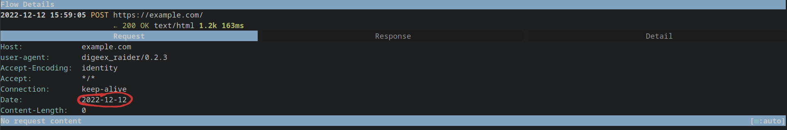

Getting Started
===============

Creating new project
--------------------

After you've installed Raider, you need to create a new project and
add hyfiles to define the information exchange. To create a new
project, run ``raider new`` command:

.. code-block:: bash

   # Either give just a project name
   $ raider new project_name
   New file name (recommended in XX_name.hy format where XX=digits): 01_test.hy

   # Or both the project name and the file name
   $ raider new project_name 01_test.hy
   

And the file at ``~/.config/raider/projects/project_name/01_test.hy``
will be opened either in the text editor defined in the ``EDITOR``
environment variable, or default to ``vim``.

To begin, let's create a "Hello World" configuration first. This is
super easy, you only need to save this in the created file:

.. code-block:: hylang

   (print "Hello World")

And you can see the text printed when running Raider:   

.. code-block:: bash

   $ raider show
   project_name
       - 01_test.hy
   
   # Run the active project
   $ raider run
   Hello World
   CRITICAL:2022-12-11 00:06:42,527:raider - DEFAULT not defined, cannot run! (raider.py:89)

   # Same as above when only 1 project
   $ raider run project_name
   Hello World
   CRITICAL:2022-12-11 00:06:47,333:raider - DEFAULT not defined, cannot run! (raider.py:89)

Adding first Flow
-----------------
   
So besides printing the "Hello World" text it can't do anything
yet. To be able to run something with Raider, you need to at least
define one Flow.

Let's create another file 02_main.hy:

.. code-block:: bash

   $ raider new project_name 02_main.hy

And add the first Flow to it. After receiving response raider will
print the HTTP headers.

.. code-block:: hylang

   (print "main.hy")		
   (setv init
       (Flow
          (Request.get
            "https://example.com/")
          :operations [(Print.headers)]))
     

Running DEFAULT FlowGraph
-------------------------
	  
Now you can see it and run the defined HTTP request. The DEFAULT
FlowGraph is created to point to the first encountered Flow. hyfiles
are processed according to their alphabetical order.

.. code-block:: 

   $ raider show
   project_name
      - 01_test.hy
      - 02_main.hy
      - _project.hy

   $ raider show --flows --graphs
   Hello World
   main.hy
   project_name
       - 02_main.hy
           + DEFAULT -> initialization
             • initialization

   $ raider run
   Hello World
   main.hy
   HTTP response headers:
   Content-Encoding: gzip
   Accept-Ranges: bytes
   Age: 589858
   Cache-Control: max-age=604800
   Content-Type: text/html; charset=UTF-8
   Date: Sat, 10 Dec 2022 23:21:04 GMT
   Etag: "3147526947"
   Expires: Sat, 17 Dec 2022 23:21:04 GMT
   Last-Modified: Thu, 17 Oct 2019 07:18:26 GMT
   Server: ECS (nyb/1D07)
   Vary: Accept-Encoding
   X-Cache: HIT
   Content-Length: 648
   CRITICAL:2022-12-11 00:21:04,978:raider - FlowGraph DEFAULT didn't return (Success). Exiting! (flowstore.py:188)

The CRITICAL error we still get is because when no Flow or FlowGraph
is specified in the ``raider run`` command, the DEFAULT FlowGraph is
used. However, since we've not defined a :class:`Success
<raider.operations.Success>` Operation the FlowGraph didn't
complete. To do so, we can edit the ``02_main.hy`` file like this:

.. code-block:: hylang

   (print "main.hy")		
   (setv initialization
       (Flow
          (Request.get
            "https://example.com/")
          :operations
	   [(Print.headers)
	    (Success)]))
     

Alternatively, you can run just by using the Flow name:

.. code-block:: bash

   $ raider run project_name initialization

Let's say we want to extract the value of one of this headers and
print only it. If you've closed the file, you can open it for editing
like this:

.. code-block:: bash

   $ raider edit project_name 02_main.hy

And now let's edit it to print our header only. To do that, create a
new plugin to store this data

.. code-block:: hylang

   (print "main.hy")

   ;; Create the `date` Header Plugin.
   (setv date (Header "Date"))
   
   (setv initialization
         (Flow
           (Request.get
             "https://example.com/")

	   ;; Extract the date from the response
           :outputs [date]
	   
           :operations [;; Print the date header only
	                (Print date)
                        (Success)]))

And if we run it, we get the date printed:

.. code-block:: bash
		
   $ raider run project_name initialization
   Hello World
   main.hy
   INFO:2022-12-12 15:50:33,200:raider - Running flow initialization (flowstore.py:149)
   Date = Mon, 12 Dec 2022 14:50:33 GMT
   INFO:2022-12-12 15:50:33,751:raider - Success: None (operations.py:745)

Now let's say we want to resend this date for another following
request as a header. To do that, we create a new Flow:

.. code-block:: hylang
   
   (setv send_date
         (Flow
           (Request.post
             "https://example.com/"
	     ;; Use :headers argument to Request to set headers
             :headers [date])))

If we want to see the request, we can use a web proxy
(ZAProxy/BurpSuite/mitmproxy/etc...) and set up raider to use the
proxy:

.. code-block:: bash

   $ raider config --proxy http://localhost:8080

To relay the traffic through this proxy you need to add ``--proxy`` to
the run command:

.. code-block:: bash

   $ raider run project_name send_date --proxy
   Hello World
   main.hy
   INFO:2022-12-12 15:58:52,528:raider - Running flow send_date (flowstore.py:149)
   Header "Date" has an empty value. Input its value manually (enter to skip)
   Date = 2022-12-12		

We get prompted for the Date value since it wasn't set in a previous
Flow (we only ran send_date for now). In the web proxy we can see the
header correctly set up:

To use the date from the previous request, we need to run those two Flows.	   

Configure your first application
--------------------------------

Use the web proxy to check the traffic generated by the
application when you log in. Remove the HTTP requests that are
irrelevant to the authentication process, like the static files. Now,
the easiest way to proceed is by going backwards. Pick up one HTTP
request that can be completed only with an authenticated user, and try
to find out what piece of information in that request indicates the user
is authenticated by removing piece by piece the irrelevant
information. It's usually a header, a cookie, or both. Identify where
this piece of data comes from. Define it using Raider Plugins. When this
is done, move on to the next request, until you reach a HTTP request
that needs no inputs. At this point, the normal authentication flow is
complete. Expand the configuration to cover other flows (Multi-factor
authentication, bad credentials, etc...).
